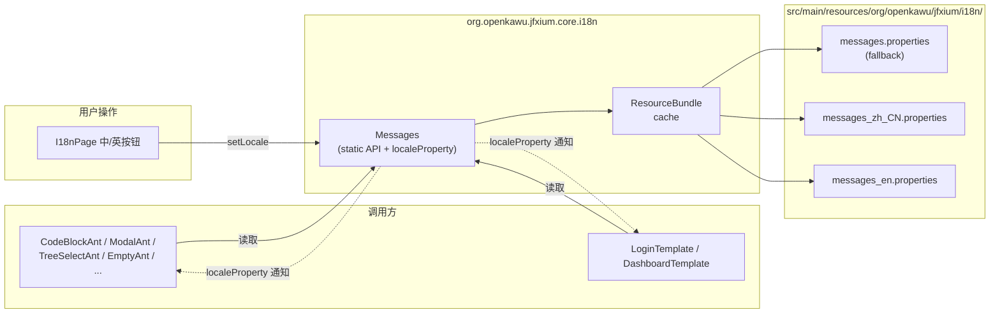
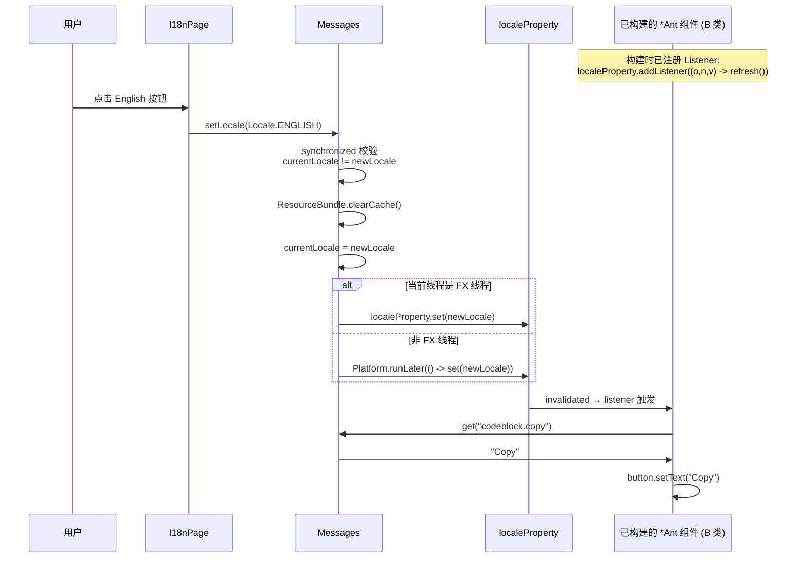

# Design Document: i18n-default-zh

## Overview

本设计为 JFXium 主框架（`jfxium/`）引入零依赖、基于 JDK `ResourceBundle` 的轻量 i18n 基础设施，并把所有面向最终用户的硬编码字符串迁移到 properties 资源文件中。设计目标按重要性排序：

1. **零依赖**：仅使用 `java.util.ResourceBundle` / `java.text.MessageFormat` / `java.util.Locale`，不引入 ICU4J 等第三方库（呼应 7.3）。
2. **默认 zh_CN**：`Messages` 类静态初始化时即把当前 Locale 设置为 `Locale.SIMPLIFIED_CHINESE`，符合项目主流用户群体（呼应 1.5）。
3. **运行时切换**：`Messages.setLocale()` 立即生效；常驻 UI 组件通过监听 `Messages.localeProperty()` 重新 `get(key)` 刷新文本，**不需要重建页面**（呼应 4.x、5.8）。
4. **保持 Builder API 兼容**：现有 `placeholder(String)` / `okText(String)` 等 setter 一律保留供调用方覆盖；只把**默认值**从字面量切换为 `Messages.get(...)` lazy 求值（呼应 3.12 / 3.13）。
5. **资源完整性可验证**：Messages 暴露 package-private 的 `validateBundles()` 方法，遍历 zh_CN bundle 全部 key，确认 en bundle 与 fallback bundle 同名 key 无缺失（呼应 2.4 / 7.5）。

整体改动面：

| 区域 | 改动类型 | 文件数（量级） |
|---|---|---|
| 新增 `core.i18n.Messages` 类 | 新增 | 1 |
| 新增 properties 资源文件 | 新增 | 3（zh_CN / en / fallback） |
| 改造 *Ant 组件默认值（CodeBlock / TreeSelect / Empty / Modal / Popconfirm / Upload / Transfer） | 修改 | ≈ 7 |
| 改造 *Template 默认值（Login / Dashboard） | 修改 | 2 |
| `module-info.java` 暴露 i18n 包 | 修改 | 1 |
| 新增 `I18nPage` showcase | 新增 | 1 |
| `ShowcaseDemo` 注册行 | 修改 | 1 |
| 单元测试 `MessagesTest` | 新增 | 1 |
| README / SKILL / PLAN 文档同步 | 修改 | 4 |

---

## Architecture

### 组件依赖与数据流

两条主流：调用方读 → `Messages.get` → ResourceBundle → properties；用户切换 → `Messages.setLocale` → localeProperty 通知 → 监听器组件刷新。



### Locale 切换时序



### 包结构归约

按项目「组件组合规范 SKILL」第七章约束，新代码归位：

| 路径 | 角色 | 命名 |
|---|---|---|
| `jfxium/src/main/java/org/openkawu/jfxium/core/i18n/Messages.java` | 框架核心工具类，全局静态 API | `Messages` |
| `jfxium/src/main/resources/org/openkawu/jfxium/i18n/messages*.properties` | 资源文件（独立目录，与 Java 包分离） | `messages*.properties` |
| `jfxium-demo/src/main/java/.../showcase/pages/I18nPage.java` | showcase 演示页 | `I18nPage`（实现 `ShowcasePage`） |
| `jfxium/src/test/java/org/openkawu/jfxium/core/i18n/MessagesTest.java` | JUnit 5 单元测试 | `MessagesTest` |

> **设计决策（D4）**：把资源文件放在 `org/openkawu/jfxium/i18n/`（而不是 Java 类所在的 `core/i18n/` 下）有两个原因：
> 1. 资源文件与代码包解耦，未来如需把 i18n 资源做成可插拔的扩展点，迁移成本低。
> 2. ResourceBundle base name 写起来更短（`org.openkawu.jfxium.i18n.messages`）。

---

## Components and Interfaces

### 1. `Messages` 类 API 设计

```java
package org.openkawu.jfxium.core.i18n;

import javafx.application.Platform;
import javafx.beans.property.ReadOnlyObjectProperty;
import javafx.beans.property.ReadOnlyObjectWrapper;

import java.text.MessageFormat;
import java.util.*;
import java.util.logging.Level;
import java.util.logging.Logger;

/**
 * JFXium 框架的 i18n 入口。
 *
 * <h2>设计原则</h2>
 * <ul>
 *   <li>零依赖：仅基于 JDK {@link ResourceBundle} / {@link MessageFormat} / {@link Locale}</li>
 *   <li>默认 zh_CN：类加载时把 currentLocale 初始化为 {@link Locale#SIMPLIFIED_CHINESE}</li>
 *   <li>运行时切换：通过 {@link #setLocale(Locale)} 立即生效，常驻组件可通过监听
 *       {@link #localeProperty()} 自行刷新</li>
 *   <li>线程安全：{@link #setLocale(Locale)} 用 synchronized 锁；property 变更
 *       通过 {@link Platform#runLater(Runnable)} 推到 JavaFX Application Thread</li>
 *   <li>缺失键不致命：缺失 key 返回 key 本身 + WARNING 日志，不抛异常</li>
 * </ul>
 *
 * <h2>使用示例</h2>
 * <pre>{@code
 * // 直接取
 * String text = Messages.get("modal.ok");                // "确定" (默认 zh_CN)
 *
 * // 参数化（占位符 {0}, {1}, ...）
 * String text = Messages.get("upload.percent", 42);      // "上传中 42%"
 *
 * // 切换语言
 * Messages.setLocale(Locale.ENGLISH);
 * Messages.get("modal.ok");                              // "OK"
 *
 * // 监听 Locale 变化（B 类常驻组件）
 * Messages.localeProperty().addListener((obs, old, locale) ->
 *         button.setText(Messages.get("modal.ok")));
 * }</pre>
 */
public final class Messages {

    /** ResourceBundle base name；resources 目录下对应 org/openkawu/jfxium/i18n/messages*.properties */
    private static final String BUNDLE_BASE = "org.openkawu.jfxium.i18n.messages";

    private static final Logger LOGGER = Logger.getLogger(Messages.class.getName());

    /**
     * 当前 Locale。volatile 保证 get 调用看到 setLocale 的最新写入。
     * 默认 zh_CN（呼应 EARS 1.5）。
     */
    private static volatile Locale currentLocale = Locale.SIMPLIFIED_CHINESE;

    /**
     * 暴露给外部监听用的只读 property（呼应 EARS 4.1）。
     * 写入只能通过 setLocale，且经 Platform.runLater 推到 FX 线程。
     */
    private static final ReadOnlyObjectWrapper<Locale> localeProperty =
            new ReadOnlyObjectWrapper<>(currentLocale);

    /** 写锁。setLocale 内串行化「比较 + 清缓存 + 更新字段 + 调度 property 写入」四步。 */
    private static final Object LOCK = new Object();

    private Messages() { /* 工具类不可实例化 */ }

    // ---------------------------------------------------------
    // Public API
    // ---------------------------------------------------------

    /** 取当前 Locale 的字符串；缺失返回 key 本身。 */
    public static String get(String key) { /* 见下文实现 */ }

    /** 取字符串并用 MessageFormat 替换占位符。 */
    public static String get(String key, Object... args) { /* 见下文实现 */ }

    /** 切换 Locale。null 抛 NPE；与当前相同则跳过（不触发 property 通知）。 */
    public static void setLocale(Locale locale) { /* 见下文实现 */ }

    /** 当前 Locale。 */
    public static Locale getLocale() { return currentLocale; }

    /** 暴露给组件订阅的只读 property。 */
    public static ReadOnlyObjectProperty<Locale> localeProperty() {
        return localeProperty.getReadOnlyProperty();
    }

    // ---------------------------------------------------------
    // Package-private validation API
    // ---------------------------------------------------------

    /**
     * 校验所有 bundle key 集合一致。
     * 在 ShowcaseDemo 启动时或单元测试中调用一次。
     *
     * @return 校验报告；若一致 {@link ValidationReport#isOk()} 为 true
     */
    static ValidationReport validateBundles() { /* 见下文实现 */ }
}
```

#### 各方法语义对照表

| 方法 | 行为契约（对应 EARS 编号） |
|---|---|
| `get(String key)` | 1.6 当前 locale bundle 命中 → 返回值；1.7 未命中 → fallback bundle；1.8 全部未命中 → 返回 key 本身 + WARNING 日志 |
| `get(String key, Object... args)` | 等价于 `MessageFormat.format(get(key), args)`（1.2） |
| `setLocale(Locale)` | 4.6 null → NPE；4.3 相同 locale → 直接 return（不触发 property）；1.10 不同 locale → `ResourceBundle.clearCache()` + 更新字段 + Platform.runLater 触发 property 通知 |
| `getLocale()` | 1.4 返回 currentLocale |
| `localeProperty()` | 4.1 返回 ReadOnly view |
| `validateBundles()` | 7.5 遍历 zh_CN 全部 key，确认 en、fallback 都有；返回报告对象 |

#### 关键实现细节

**`get(String key)` 三级回退**：

```java
public static String get(String key) {
    Locale locale = currentLocale;
    // Level 1: current locale
    try {
        return ResourceBundle.getBundle(BUNDLE_BASE, locale).getString(key);
    } catch (MissingResourceException ignored) {
        // 落空，尝试 fallback
    }
    // Level 2: fallback bundle (Locale.ROOT → messages.properties，无 locale 后缀)
    try {
        return ResourceBundle.getBundle(BUNDLE_BASE, Locale.ROOT).getString(key);
    } catch (MissingResourceException ignored) {
        // 全部缺失
    }
    // Level 3: return key + WARNING log
    LOGGER.log(Level.WARNING, "i18n key 缺失: {0} (locale={1})",
               new Object[]{ key, locale });
    return key;
}
```

> **设计决策（D7）**：JDK 的 `ResourceBundle.getBundle(base, locale)` 自身就有 fallback 行为（`zh_CN → zh → ROOT`），但仍然显式调用 `Locale.ROOT` 一次。原因：当传入 `Locale.ENGLISH` 时，JDK 的搜索顺序是 `en → ROOT`（不会触发 zh_CN），如果 en 缺 key 而 zh_CN 有，按要求 1.7「回退到 messages.properties」（与 zh_CN 一致），这条逻辑由 fallback bundle = zh_CN 副本来兜底。**显式回到 ROOT** 让控制流明确，不被 JDK 隐式 fallback chain 行为变化影响。

**`setLocale(Locale)` 线程安全实现**：

```java
public static void setLocale(Locale locale) {
    if (locale == null) {
        throw new NullPointerException("locale 不能为 null");   // 4.6
    }
    synchronized (LOCK) {
        if (locale.equals(currentLocale)) {
            return;   // 4.3 相同 locale 不触发 property
        }
        currentLocale = locale;
        ResourceBundle.clearCache();    // 1.10 强制下次 getBundle 重新加载
    }
    // 切到 FX 线程更新 property（4.5 线程安全）
    if (Platform.isFxApplicationThread()) {
        localeProperty.set(locale);
    } else {
        Platform.runLater(() -> localeProperty.set(locale));
    }
}
```

> **设计决策（D8）**：把 `localeProperty.set` 放到锁外，避免持锁调用 JavaFX API（FX listener 可能反向回调外部代码）造成死锁。`currentLocale` 是 volatile 的，调度到 FX 线程时读到的就是最新值。

### 2. *Ant 组件迁移策略：A 类 vs B 类

迁移所有面向用户的硬编码字符串到 `Messages.get(...)` lazy 求值，但**是否随 Locale 切换刷新**取决于组件生命周期。按此把组件分两类：

#### 分类标准

| 类别 | 特征 | 是否监听 `localeProperty` | 适用场景 |
|---|---|---|---|
| **A 类（不刷新）** | 一次性弹窗 / 短生命周期 | ❌ 不监听 | 弹一次销毁、Locale 切换发生概率极低、监听器会增加泄漏面 |
| **B 类（动态刷新）** | 常驻 UI / 长生命周期 | ✅ 监听 localeProperty | 一直显示在容器树里、用户期望切 Locale 后立即看到变化 |

#### 各组件归类

| 组件 | 类别 | 理由 |
|---|---|---|
| `ModalAnt` | **A 类** | 弹一次销毁。Modal open 后短期内不会切 Locale；listener 反而会带泄漏风险（close 后 listener 仍持引用） |
| `PopconfirmAnt` | **A 类** | 同 Modal。气泡弹出 → 用户点 Yes/No → 销毁 |
| `LoginTemplate` | **A 类** | 登录后页面切走（被替换为主面板）；表单文案在登录瞬间渲染一次足够 |
| `CodeBlockAnt` | **B 类** | 常驻代码展示组件（如 ShowcasePage、Crud 错误展示），用户切 Locale 后期望看到 "Copy" / "复制" 立即变化 |
| `TreeSelectAnt` | **B 类** | 表单/筛选场景常驻容器中。placeholder 应跟随 Locale |
| `EmptyAnt` | **B 类** | 数据列表的空态占位，常驻在 Table/List 内部，可能挂很久 |
| `UploadAnt` | **B 类** | dragText / hintText 始终在拖拽区显示，常驻容器中 |
| `TransferAnt` | **B 类** | 双列穿梭框是表单常驻控件 |
| `DashboardTemplate` | **B 类** | 仪表盘是首页常驻页面，"较上周"等文案需跟随 Locale |

#### 模式 A：默认值 lazy 求值（所有组件统一）

```java
// === 迁移前 ===
public static class Builder {
    private String placeholder = "请选择";              // ← 字面量默认值
    public Builder placeholder(String p) { this.placeholder = p; return this; }
}
// build():
field.setPromptText(placeholder);
```

```java
// === 迁移后 ===
public static class Builder {
    // 关键：默认值改为 null 标记「未显式设置」，不要写
    //   private String placeholder = Messages.get("treeselect.placeholder");
    // 因为字段初始化只发生在 Builder 实例化那一刻，会被钉死在当时的 locale。
    private String placeholder = null;
    public Builder placeholder(String p) { this.placeholder = p; return this; }
}
// build():
String effective = (placeholder != null)
        ? placeholder
        : Messages.get("treeselect.placeholder");
field.setPromptText(effective);
```

> **设计决策（D1）**：**绝不**把默认值写成 `private String placeholder = Messages.get(...)`。
> 字段初始化只在 Builder 实例化那一刻执行一次；如果用户 `Builder.create()` 之后再 `Messages.setLocale(en)`，build() 拿到的还是 zh_CN 文案。统一做成 build() 时 lazy 求值。

#### 模式 B：B 类组件追加 listener

```java
// build() 内，对未显式覆盖的字段挂监听器
String effective = (placeholder != null)
        ? placeholder
        : Messages.get("treeselect.placeholder");
field.setPromptText(effective);

// 仅当用户没显式覆盖时，挂 listener
if (placeholder == null) {
    Messages.localeProperty().addListener((obs, old, loc) ->
            field.setPromptText(Messages.get("treeselect.placeholder")));
}
```

> **设计决策（D2）**：listener 只在调用方未显式覆盖时挂。如果调用方传了自己的 placeholder，那字符串属于业务（可能是动态拼接的），框架不应擅自在 Locale 切换时改它。
>
> **设计决策（关于 WeakListener）**：本特性范围内 B 类组件 listener 与 Node 等长（页面销毁会同时回收组件 → listener）。不引入 `WeakChangeListener` 包装。**未来**如果业务出现频繁创建/销毁含 i18n 文案组件的场景（例如虚拟列表 cell 复用），需要补一层 weak 包装防内存泄漏；本里程碑遵循极简至上原则不引入。

#### 关键代码对照（5 个代表性组件）

##### 2.1 CodeBlockAnt（B 类）

```java
// === 迁移前 ===
if (copyable) {
    Button copyBtn = new Button("复制");                                 // ← 硬编码
    copyBtn.setOnAction(e -> {
        // ... 复制到剪贴板
        copyBtn.setText("已复制!");                                      // ← 硬编码
        PauseTransition pause = new PauseTransition(Duration.millis(1500));
        pause.setOnFinished(ev -> copyBtn.setText("复制"));               // ← 硬编码
        pause.play();
    });
}

// === 迁移后 ===
if (copyable) {
    Button copyBtn = new Button(Messages.get("codeblock.copy"));
    // B 类：监听 locale 切换刷新初始文案
    Messages.localeProperty().addListener((obs, old, loc) ->
            copyBtn.setText(Messages.get("codeblock.copy")));
    copyBtn.setOnAction(e -> {
        // ... 复制到剪贴板
        copyBtn.setText(Messages.get("codeblock.copied"));
        PauseTransition pause = new PauseTransition(Duration.millis(1500));
        pause.setOnFinished(ev -> copyBtn.setText(Messages.get("codeblock.copy")));
        pause.play();
    });
}
```

##### 2.2 TreeSelectAnt（B 类）

```java
// === 迁移前 ===
private String placeholder = "请选择";
// build():
field.setPromptText(placeholder);

// === 迁移后 ===
private String placeholder = null;
public Builder placeholder(String p) { this.placeholder = p; return this; }
// build():
String effective = (placeholder != null)
        ? placeholder : Messages.get("treeselect.placeholder");
field.setPromptText(effective);
if (placeholder == null) {
    Messages.localeProperty().addListener((obs, o, l) ->
            field.setPromptText(Messages.get("treeselect.placeholder")));
}
```

##### 2.3 EmptyAnt（B 类）

```java
// === 迁移前 ===
private String description = "No Data";
// build():
Label descLabel = new Label(description);

// === 迁移后 ===
private String description = null;
// build():
String effective = (description != null) ? description : Messages.get("empty.description");
Label descLabel = new Label(effective);
if (description == null) {
    Messages.localeProperty().addListener((obs, o, l) ->
            descLabel.setText(Messages.get("empty.description")));
}
```

##### 2.4 ModalAnt（A 类）

```java
// === 迁移前 ===
private String okText = "OK";
private String cancelText = "Cancel";

// === 迁移后 ===
private String okText = null;
private String cancelText = null;
// build():
String effectiveOk     = (okText     != null) ? okText     : Messages.get("modal.ok");
String effectiveCancel = (cancelText != null) ? cancelText : Messages.get("modal.cancel");
Button okBtn     = ButtonAnt.create(effectiveOk).type(PRIMARY).build();
Button cancelBtn = ButtonAnt.create(effectiveCancel).build();
// A 类：不挂 localeProperty listener（短生命周期，open 后短期不会切 locale）
```

##### 2.5 LoginTemplate（A 类，多 key 集中迁移）

```java
// === 迁移前（节选）===
private String brandName = "JFXium Admin";
private String formTitle = "登录账号";
private String submitText = "登 录";
// build():
Label name = new Label(brandName);
Button loginBtn = ButtonAnt.create(submitText).build();
errorLabel.setText("请输入" + usernamePlaceholder);
Label noAccount = new Label("还没账号？");
Hyperlink registerLink = new Hyperlink("立即注册");

// === 迁移后 ===
private String brandName = null;
private String formTitle = null;
private String submitText = null;
// ... 共 11 个字段一律改为 null + setter 保留
// build():
Label name = new Label(brandName != null ? brandName : Messages.get("login.brand_name"));
Button loginBtn = ButtonAnt.create(
        submitText != null ? submitText : Messages.get("login.submit_text")).build();
errorLabel.setText(Messages.get("login.error_prefix")
        + (usernamePlaceholder != null ? usernamePlaceholder
                                       : Messages.get("login.username_placeholder")));
Label noAccount = new Label(Messages.get("login.no_account"));
Hyperlink registerLink = new Hyperlink(Messages.get("login.register"));
// A 类：不挂 localeProperty listener
```

##### 其他组件

`PopconfirmAnt` / `UploadAnt` / `TransferAnt` / `DashboardTemplate` 按相同模式迁移：

- 默认值由字面量改 null
- build() 阶段 `effective = (field != null) ? field : Messages.get(key)`
- 按上表分类决定是否挂 localeProperty listener（B 类挂，A 类不挂）

### 3. I18nPage 设计

布局结构（采用「组件组合规范」第三章「Header 三段式」+ 多个 ShowcaseSection 串联）：

```
VBox（页根容器）
├── Label  pageTitle  "I18n 国际化"
├── Label  pageDesc   "演示运行时 Locale 切换……"
├── HBox   localeSwitcher
│   ├── ButtonAnt "中文"     → Messages.setLocale(Locale.SIMPLIFIED_CHINESE)
│   └── ButtonAnt "English"  → Messages.setLocale(Locale.ENGLISH)
├── ShowcaseSection "CodeBlock"      → CodeBlockAnt 实例（演示 codeblock.copy）
├── ShowcaseSection "TreeSelect"     → TreeSelectAnt 实例（演示 treeselect.placeholder）
├── ShowcaseSection "Empty"          → EmptyAnt 实例（演示 empty.description）
└── ShowcaseSection "Modal 触发"     → 触发按钮 + 点击时 ModalAnt 弹窗（演示 modal.ok / modal.cancel）
```

切换 Locale 后：

- 已构建的 **B 类组件**（CodeBlock / TreeSelect / Empty）通过 localeProperty listener 自动刷新文案，**不重建页面**（呼应 5.8）。
- 触发按钮点击后弹出的 **A 类 ModalAnt**：每次新 open 都按当前 Locale 渲染按钮文案。

`ShowcasePage` 接口实现：

| 方法 | 返回值 |
|---|---|
| `key()` | `"i18n"` |
| `title()` | `"I18n 国际化"`（注意：showcase 目录是设计期内容，**不**i18n 化——本特性面向终端用户文案，不含 demo 自身的展示骨架） |
| `category()` | `Category.OTHER`（与 WatermarkPage 同分类，呼应 5.9） |
| `getView()` | 返回上述 VBox |

注册行（呼应 5.3）：

```java
// ShowcaseDemo.java，「其他」分组：
frame.register(new WatermarkPage());
frame.register(new I18nPage());     // ← 新增
```

### 4. 资源完整性校验

`Messages.validateBundles()` 实现思路：

```java
record ValidationReport(boolean ok, List<String> missingInEn, List<String> missingInFallback) {
    boolean isOk() { return ok; }
}

static ValidationReport validateBundles() {
    ResourceBundle zhCn = ResourceBundle.getBundle(BUNDLE_BASE, Locale.SIMPLIFIED_CHINESE);
    ResourceBundle en   = ResourceBundle.getBundle(BUNDLE_BASE, Locale.ENGLISH);
    ResourceBundle root = ResourceBundle.getBundle(BUNDLE_BASE, Locale.ROOT);

    List<String> missingInEn = new ArrayList<>();
    List<String> missingInFallback = new ArrayList<>();
    for (String key : Collections.list(zhCn.getKeys())) {
        if (!en.containsKey(key))   missingInEn.add(key);
        if (!root.containsKey(key)) missingInFallback.add(key);
    }
    return new ValidationReport(
            missingInEn.isEmpty() && missingInFallback.isEmpty(),
            missingInEn, missingInFallback
    );
}
```

调用时机：

1. **单元测试**：`MessagesTest.validateBundles_allKeysPresent()` 断言 `report.isOk() == true`。
2. **运行时（可选）**：可在 `ShowcaseDemo.start()` 启动早期调用一次，输出 INFO 日志；缺失则 SEVERE 不阻断启动。

> **设计决策（D6）**：不在 jfxium 主框架代码入口里调 validateBundles。原因：
> - 框架本身没有 main——加在哪里都很别扭。
> - 这是「构建期一致性」检查，更适合放测试。
> - 留 `validateBundles()` 为 package-private，方便集成方/showcase 自行调用。

### 5. module-info 调整

```java
module org.openkawu.jfxium {
    requires javafx.controls;
    requires javafx.fxml;

    exports org.openkawu.jfxium.core.token;
    exports org.openkawu.jfxium.core.theme;
    exports org.openkawu.jfxium.core.css;
    exports org.openkawu.jfxium.core.animation;
    exports org.openkawu.jfxium.core.layout;
    exports org.openkawu.jfxium.core.i18n;          // ← 新增：暴露 Messages
    exports org.openkawu.jfxium.component;
    exports org.openkawu.jfxium.component.base;
}
```

> **关于资源文件可见性**：`org/openkawu/jfxium/i18n/messages*.properties` 不是 Java 包，是资源路径。在同一模块内，`ResourceBundle.getBundle(...)` 能直接读到。**不需要** `opens` 声明（`opens` 是给反射用的；`getBundle` 走 `Class.getResourceAsStream` 路径，同模块内不受 module 强封装影响）。

---

## Data Models

### 1. i18n key 命名约定

格式：**`组件名小写.元素名`**（呼应 EARS 2.7），例：

| key | 用途 |
|---|---|
| `codeblock.copy` | CodeBlockAnt 复制按钮初始文案 |
| `codeblock.copied` | CodeBlockAnt 复制后反馈文案 |
| `treeselect.placeholder` | TreeSelectAnt 默认 placeholder |
| `modal.ok` | ModalAnt 默认确认按钮 |
| `login.brand_name` | LoginTemplate 默认品牌名（多词用下划线） |
| `dashboard.trend.compare_last_week` | DashboardTemplate 趋势文案（多级用点号） |

约束：

- 全部小写
- 单词分隔用下划线（`brand_name`、`drag_text`），层级分隔用点号（`dashboard.trend.compare_last_week`）
- 组件名取 *Ant 前缀的小写（`CodeBlockAnt` → `codeblock`）

### 2. properties 文件初稿

完整 key 清单基于 requirements 第 3 章迁移目标整理。三份文件 key **完全一致**（呼应 EARS 2.4），只是 value 不同。

#### `messages_zh_CN.properties`（默认）

```properties
# ============================================================
# JFXium i18n - Simplified Chinese
# 与 messages.properties (fallback) 内容完全一致
# ============================================================

# CodeBlockAnt
codeblock.copy=复制
codeblock.copied=已复制!

# TreeSelectAnt
treeselect.placeholder=请选择

# EmptyAnt
empty.description=暂无数据

# ModalAnt
modal.ok=确定
modal.cancel=取消

# PopconfirmAnt
popconfirm.ok=是
popconfirm.cancel=否

# UploadAnt
upload.button_text=点击上传
upload.drag_text=点击或拖拽文件到此区域上传
upload.hint_text=支持单个或批量上传
upload.error=错误

# TransferAnt
transfer.source_title=源
transfer.target_title=目标
transfer.search_placeholder=搜索

# LoginTemplate
login.brand_name=JFXium Admin
login.tagline=现代化管理系统
login.copyright=© 2026 · MIT License
login.form_title=登录账号
login.form_subtitle=欢迎回来，请输入凭证以继续
login.username_placeholder=用户名
login.password_placeholder=密码
login.submit_text=登 录
login.error_prefix=请输入
login.no_account=还没账号？
login.register=立即注册

# DashboardTemplate
dashboard.trend.compare_last_week=较上周
```

#### `messages_en.properties`

```properties
# ============================================================
# JFXium i18n - English
# ============================================================

# CodeBlockAnt
codeblock.copy=Copy
codeblock.copied=Copied!

# TreeSelectAnt
treeselect.placeholder=Please select

# EmptyAnt
empty.description=No Data

# ModalAnt
modal.ok=OK
modal.cancel=Cancel

# PopconfirmAnt
popconfirm.ok=Yes
popconfirm.cancel=No

# UploadAnt
upload.button_text=Click to Upload
upload.drag_text=Click or drag file to this area to upload
upload.hint_text=Support for single or bulk upload
upload.error=Error

# TransferAnt
transfer.source_title=Source
transfer.target_title=Target
transfer.search_placeholder=Search

# LoginTemplate
login.brand_name=JFXium Admin
login.tagline=Modern Admin System
login.copyright=© 2026 · MIT License
login.form_title=Sign In
login.form_subtitle=Welcome back. Please enter your credentials.
login.username_placeholder=Username
login.password_placeholder=Password
login.submit_text=Sign In
login.error_prefix=Please enter
login.no_account=No account yet?
login.register=Register now

# DashboardTemplate
dashboard.trend.compare_last_week=vs last week
```

#### `messages.properties`（fallback；与 zh_CN 内容完全一致）

```properties
# ============================================================
# JFXium i18n - Fallback Bundle
# 内容与 messages_zh_CN.properties 一致（呼应 EARS 2.1）
# 用途：当 setLocale(unknown_locale) 被调用且 unknown bundle 缺 key 时兜底
# ============================================================

# 内容（略，与 messages_zh_CN.properties 完全一致）
```

> **编码**：JDK 9+ 起 `ResourceBundle.getBundle` 默认按 UTF-8 解析 properties 文件，不需要 native2ascii。直接以 UTF-8 写中文即可（呼应 EARS 2.5）。

---

## Correctness Properties

*A property is a characteristic or behavior that should hold true across all valid executions of a system—essentially, a formal statement about what the system should do. Properties serve as the bridge between human-readable specifications and machine-verifiable correctness guarantees.*

> **PBT 适用性结论**：本特性的 universal 性质多为「集合相等性」「枚举式断言」（key 是固定集合，Locale 是有限集），输入空间小，PBT 100 次随机迭代不会比 5-10 个 JUnit 枚举用例更有价值。**Correctness Properties 仍以 universal 形式表达**，供测试编写时参照、并作为后续追加 PBT 库时的形式化基础；当前里程碑用 JUnit 5 标准断言覆盖（详见 Testing Strategy）。

### Property 1: 资源 bundle key 集合一致性

*For all* keys k in `messages_zh_CN.properties`, k 同时存在于 `messages_en.properties` 与 `messages.properties` (fallback)。

形式化：`∀ k ∈ zhCn.getKeys() : k ∈ en.getKeys() ∧ k ∈ fallback.getKeys()`

**Validates: Requirements 2.1, 2.4, 3.15, 7.5**

### Property 2: `Messages.get` 永不返回 null

*For all* 字符串 key k，`Messages.get(k)` 返回非 null 字符串。当 key 在所有 bundle 中都不存在时，返回 k 本身（占位字符串）。

形式化：`∀ k : Messages.get(k) ≠ null`

**Validates: Requirements 1.6, 1.7, 1.8**

### Property 3: 参数化 get 等价于 MessageFormat

*For all* key k 与参数数组 args，`Messages.get(k, args)` 等价于 `MessageFormat.format(Messages.get(k), args)`。

形式化：`∀ k, args : Messages.get(k, args) ≡ MessageFormat.format(Messages.get(k), args)`

**Validates: Requirements 1.2**

### Property 4: 相同 Locale 不触发 property 通知

*For all* Locale l，若 `Messages.getLocale().equals(l)`，则调用 `Messages.setLocale(l)` 不会导致 `localeProperty()` 触发任何 invalidation/change 通知。

形式化：`setLocale(currentLocale) does not trigger localeProperty change`

**Validates: Requirements 4.3**

### Property 5: 不同 Locale 触发恰好一次 property 通知

*For all* 不同于当前 Locale 的 Locale l'，调用 `Messages.setLocale(l')` 后 `localeProperty()` 触发恰好一次 ChangeListener 通知，且通知中的 newValue 等于 l'。

形式化：`∀ l' ≠ currentLocale : setLocale(l') ⇒ localeProperty fires exactly once with newValue=l'`

**Validates: Requirements 4.2, 1.10**

### Property 6: null Locale 抛 NullPointerException

`Messages.setLocale(null)` 必然抛出 `NullPointerException`，且异常消息中包含 "locale" 字样以便排查。

形式化：`setLocale(null) ⇒ throws NullPointerException`

**Validates: Requirements 4.6**

### Property 7: setLocale 后 get 立即生效

*For all* Locale l 与 key k（在 l 对应 bundle 中存在），`Messages.setLocale(l)` 返回后，**同线程**立即调用 `Messages.get(k)` 返回 l 对应 bundle 的值。

形式化：`∀ l, k ∈ bundle(l) : setLocale(l); get(k) == bundle(l).getString(k)`

注：仅覆盖 Requirement 4.5 的「线程内一致性」语义；跨线程 FX 通知由 Property 5 单独覆盖。

**Validates: Requirements 1.10, 4.5**

### Property 8: 默认 Locale 为 zh_CN

类首次加载后、未调用 setLocale 之前，`Messages.getLocale()` 等于 `Locale.SIMPLIFIED_CHINESE`。

形式化：`initial state: getLocale() == Locale.SIMPLIFIED_CHINESE`

**Validates: Requirements 1.5**

### Property 9: jfxium 主框架运行时硬编码扫描为零

对 `jfxium/src/main/java` 全量 grep（排除 javadoc / 注释 / 异常消息 / styleClass 字符串），不应再出现要求 3 列出的硬编码 UI 文案字面量。

形式化：`∀ f ∈ jfxium/src/main/java : runtime UI hardcoded strings in f == ∅`

**Validates: Requirements 3.1**

> 该 property 通过仓库级 grep 脚本（非 JUnit）验证。

---

## Error Handling

| 场景 | 处理方式 |
|---|---|
| `Messages.get(unknown_key)` | 返回 key 本身 + WARNING 日志（不抛异常）。理由：UI 渲染优先级高于 i18n 完整性，缺 key 让用户看到占位 key 总好过整个页面崩溃。 |
| `Messages.setLocale(null)` | 立即抛 `NullPointerException("locale 不能为 null")`。理由：null 是程序错误，必须暴露而非静默回退到默认值。 |
| `MessageFormat` 占位符与参数个数不匹配 | 由 JDK `MessageFormat.format` 原生处理（缺参数时占位符原样保留 `{0}`）。框架不再二次包装。 |
| 资源文件物理缺失（构建错误） | `ResourceBundle.getBundle` 抛 `MissingResourceException`。框架在 `get(key)` 内捕获，走三级回退最终返回 key + WARNING 日志，**保证 UI 不崩**。 |
| `ResourceBundle.clearCache()` 在 setLocale 中失败 | 不可能（JDK 内部方法），无需处理。 |
| Listener 在 Locale 切换 callback 内抛异常 | JavaFX property 框架会 swallow 异常并打日志，不会影响后续 listener。框架不额外包装。 |
| 资源 bundle key 集合不一致（en 缺了 zh_CN 有的 key） | 单元测试 `validateBundles_allKeysPresent()` 失败、CI 阻断；运行时调用 `Messages.get(missing_key)` 走三级回退到 fallback bundle，仍能返回中文文案，不崩 UI。 |

---

## Testing Strategy

### PBT 适用性评估

按 requirements-first workflow 的 PBT 决策指南：

- **Messages.get / setLocale / getLocale**：纯函数行为，但输入空间小（key 是固定集合、Locale 也是有限集）。PBT 100 次随机迭代不会显著优于 5-10 个枚举用例。
- **资源 bundle 一致性**：是「集合相等性」断言，遍历一遍即可，不需要随机。
- **没有 parser/serializer**：本特性不涉及序列化或解析，没有 round-trip 必要。

**结论**：本特性**不引入 PBT 库**，使用 JUnit 5 标准断言覆盖所有 Correctness Properties。这与 requirements 7.3「不引入第三方 i18n 库依赖」的零依赖原则相符（JUnit 已是测试默认依赖）。

### 单元测试套件 `MessagesTest`

位置：`jfxium/src/test/java/org/openkawu/jfxium/core/i18n/MessagesTest.java`

| # | 测试方法 | 验证 Property | 大致逻辑 |
|---|---|---|---|
| 1 | `defaultLocale_isSimplifiedChinese` | P8 | 类初次加载（隔离测试）后 `getLocale() == zh_CN` |
| 2 | `get_returnsZhCnByDefault` | P2 | `get("modal.ok")` 返回 "确定" |
| 3 | `get_returnsKeyWhenMissingFromAllBundles` | P2 | `get("nonexistent.key")` 返回 "nonexistent.key"，并断言 WARNING 日志（用 `Logger.addHandler(LogRecord 捕获器)`） |
| 4 | `get_fallbackToRootWhenLocaleBundleMisses` | P2 | 模拟某 key 仅在 fallback 存在（测试时构造一份缺 key 的临时 locale 场景） |
| 5 | `getWithArgs_equivalentToMessageFormat` | P3 | 对若干带占位符的 key，断言 `get(k, args)` 与 `MessageFormat.format(get(k), args)` 完全相等 |
| 6 | `setLocale_null_throwsNpe` | P6 | `assertThrows(NullPointerException.class, () -> setLocale(null))` 且消息包含 "locale" |
| 7 | `setLocale_sameLocale_doesNotNotify` | P4 | 注册 listener，`setLocale(getLocale())` 后断言 listener 调用次数 = 0 |
| 8 | `setLocale_differentLocale_notifiesOnce` | P5 | 注册 listener，`setLocale(en)` 后等待 FX 线程刷新，断言 listener 调用次数 = 1 且 newValue == en |
| 9 | `setLocale_then_get_returnsNewLocaleString` | P7 | `setLocale(en)` 后立即 `get("modal.ok") == "OK"`；切回 zh 后 `== "确定"` |
| 10 | `validateBundles_allKeysPresent` | P1 | `validateBundles().isOk() == true` |
| 11 | `localeProperty_isReadOnly` | P5 (附带) | `localeProperty()` 返回类型不可强转为 `WritableValue`（防外部直写） |

**FX 线程问题**：测试 7-9 涉及 `Platform.runLater`，需在 JUnit setup 中初始化 JavaFX Toolkit（`new JFXPanel()` 或 `Platform.startup(() -> {})`），并用 `CountDownLatch` 等待回调。

### 集成校验

`MessagesTest.validateBundles_allKeysPresent`（与表中 #10 同条）覆盖 Requirement 7.5。

### 不在测试范围

- 性能测试（属性 7 不要求）
- ResourceBundle 自身行为（JDK 已测）
- JavaFX `Platform.runLater` 自身（JDK 已测）
- 实际 UI 渲染回归（手动启动 showcase 切换 locale 即可，不写自动化）

### 仓库级 lint（非 JUnit）

Property 9（无硬编码扫描）通过 `tasks.md` 的最后一个任务（一段 grep 脚本+expected empty 输出）人工验证。脚本示例：

```bash
# 扫描中文运行时硬编码字符串（排除注释 / styleClass / 异常消息 / Messages 类自身）
grep -rn '"[一-龥]' jfxium/src/main/java \
  | grep -v -E '(\s\*|^\s*//|getStyleClass|setStyle|new RuntimeException|throw new)' \
  | grep -v 'i18n/Messages.java'
# 预期输出：空（或只剩注释 / 异常消息）
```

---

## 附：决策日志（Decision Log）

| # | 决策 | 替代方案 | 选择理由 |
|---|---|---|---|
| D1 | Builder 默认值用 null + build() 时 lazy 求值 | 字段初始化时 `Messages.get(...)` | 避免 Builder 实例化时锁死 locale；切 locale 后新建组件能取最新文案 |
| D2 | 长生命周期组件（B 类）挂 localeProperty listener | 全局组件树重构 | 避免重建页面；listener 与 Node 同生命周期，本特性无内存风险 |
| D3 | Modal/Drawer/LoginTemplate（A 类）不挂 listener | 一律挂 listener | 短生命周期组件挂 listener 增加泄漏面，无收益 |
| D4 | properties 文件放 `org/openkawu/jfxium/i18n/` 而非 `core/i18n/` | 与代码同包 | 资源/代码解耦，未来便于做插件化扩展点 |
| D5 | 不引入 PBT 库 | 用 jqwik 跑 100 次 | 输入空间小，5-10 枚举用例已足够；零依赖原则 |
| D6 | 不在生产代码入口调 validateBundles | 启动时校验阻断 | jfxium 是库无入口；测试是更合适的校验时机 |
| D7 | get 内显式两段 try（current → ROOT）而非依赖 JDK fallback chain | 单次 getBundle 让 JDK 自动 fallback | 控制流明确；不被 JDK 隐式 chain（如 `en → ROOT`）行为变化影响 |
| D8 | setLocale 用 synchronized + Platform.runLater 而非 ReadWriteLock | 用 ReadWriteLock | get 用 volatile 字段读已足够；写少读多场景 synchronized 简单可靠 |
