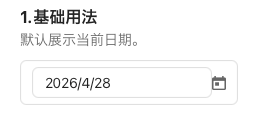
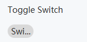
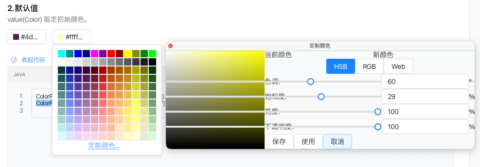
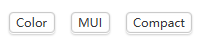
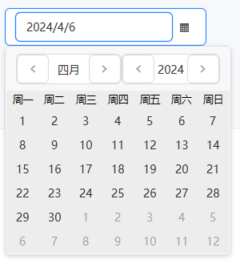
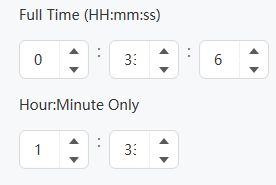

# 问题
模仿ANt Design 组件 , 与 AtlantaFX 本地代码在 F:\workspace-open-code\atlantafx\sampler ）
1: 好些 那些 输入框 没有 Hover Effect（悬停效果 主题色）, 但是吧 其他组件应不应该有 我不清楚, 需要你去 分析所有组件'; 参考ant 的组件 哪些有? 应该加哪些?

2: 这个  Slider 怎么超出 容器框的边框 了?? 怎么回事? 代码问题就需要你修复
3: TextArea 这个 不错哦!  ,但是呢 我需要 一种 组件 来 显示 抙种 报错信息 别人能复制的那种, 又看不出来 是 输入框!
 

4: Switch 显示有问题 ,不是 ant 那种 切换滑动的 效果; 

5: 你看这个 Mui 主题的 阴影线 与边框 中间还有白色 空白区域???? 

6: 组件 小型化, 封装, 可组合性, 比如 Mo
7: Slinner  获取到焦点 就 会微型控件变大 这是一个BUG; 需要修复;
8: 输入框 获取到焦点 就 会微型控件变大 这是一个BUG; 需要修复;
9: 其他输入 检查 获取到焦点 就 会微型控件变大  是否存在此问题!
10: Anchor 与 tabs 有什么区别?? 是否重复组件???? 而且还是损坏的组件?  如果重复删除它, 如果其他地方引入 需合理处理!

11: DatePicker 很丑陋, 需要修复; 根本不是 ant 那种样式;

12: TimePicker 默认太短,看不全两位数字;
以上问题修复一个 ,提交 git本地;