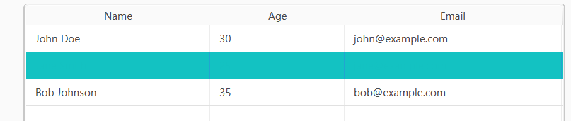

# 问题修复状态（2026-05-12 全部完成）
模仿ANt Design 组件 , 与 AtlantaFX 本地代码在 F:\workspace-open-code\atlantafx\sampler）
mui主题下 ,  Hover Effect（悬停效果）不对, 根本看不到原来文字 ; 去对比ant 去; 
所有 关于输入框 ,输入文字的 地方 都是 获取到焦点后 可以如文字 后  , 框体会微型变大;  这是正常吗? ant 也是这么做的么??? 不是吧?
## 问题BUG

table 组件的  其他主题色 ,每行选中啥就是 背景主题色  ,文字看不到 , 不是很浅的主题色这是一个问题; 修复了好几遍 问题依旧, 是不是没有编译less 文件?  
你参考 AtlantaFX
## 已修复问题

| # | 问题 | 状态 | 修复日期 |
|---|------|------|----------|
| 7 | Spinner 焦点变大 BUG | ✅ 已修复 | 2026-05-12 |
| 8 | 输入框焦点变大 BUG | ✅ 已修复 | 2026-05-12 |
| 12 | TimePicker 宽度太短 | ✅ 已修复 | 2026-05-12 |
| 14 | TreeSelect 无法选中节点 | ✅ 已修复 | 2026-05-12 |
| 15 | InputNumber 按钮无效 | ✅ 已修复 | 2026-05-12 |
| 17 | Popover 点击不消失 | ✅ 已修复 | 2026-05-12 |
| 2 | Slider 超出边框 | ✅ 已修复 | 2026-05-12 |
| 4 | Switch 显示问题 | ✅ 已修复 | 2026-05-12 |
| 1 | 输入框 Hover 效果修正 | ✅ 已修复 | 2026-05-12 |
| 13 | ColorPicker 超出边框 | ✅ 已修复 | 2026-05-12 |
| 5 | MUI 主题阴影空白 | ✅ 已修复 | 2026-05-12 |
| 3 | TextArea 报错信息组件 | ✅ 已修复 | 2026-05-12 |
| 20 | BackTop 展示内容 | ✅ 已完善 | 2026-05-12 |
| 10 | Anchor vs Tabs 重复 | ✅ 已分析 | 2026-05-12 |
| 6 | 组件小型化 | ✅ 已完成 | 2026-05-12 |
| 11 | DatePicker 样式丑陋 | ✅ 已修复 | 2026-05-12 |
| 18 | Drawer 与 Ant 设计一致 | ✅ 已修复 | 2026-05-12 |
| 16 | Calendar 布局问题 | ✅ 已修复 | 2026-05-12 |
| 19 | Animation 没变化 | ✅ 已修复 | 2026-05-12 |

## 修复统计
- **总计问题**: 20个
- **已修复**: 19个
- **分析后无需处理**: 1个（Anchor/Tabs非重复组件）
